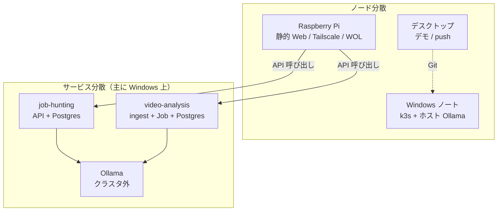
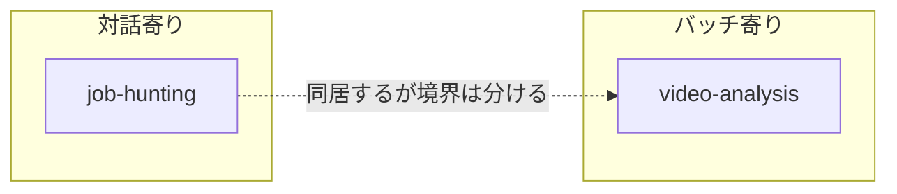
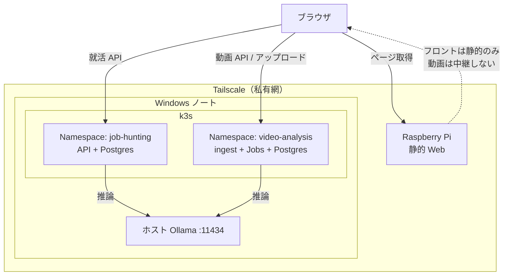
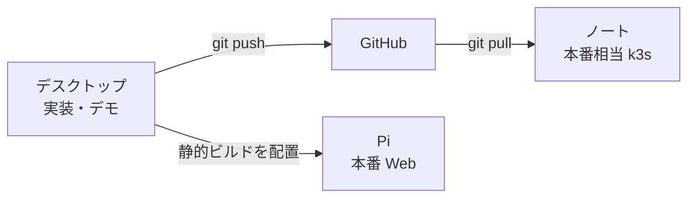
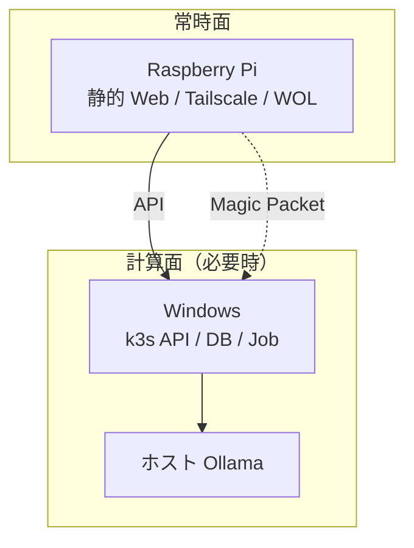
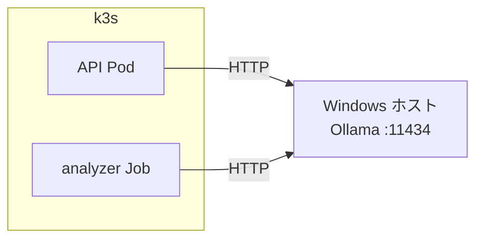

## この記事で書くこと

目的は **Kubernetes の学習** である。チュートリアル用のサンプルだけだと、Namespace の切り方や Job の使いどころが腹に落ちにくい。そこで、自宅に載せる実アプリを題材にして、マニフェストと運用を練習することにした。

題材はふたつある。就活の経験ログをローカル RAG で引き出す系と、ゲーム動画を解析して振り返りを残す系。どちらも個人データなのでクラウド LLM には送らない。GitHub は公開前提で、秘密はリポに入れない。

最終形は **分散アーキテクチャ** である。クラウドの大規模分散ではなく、自宅の複数マシンと複数サービスに処理を分けた構成、という意味で使っている。本稿では「なぜ分散にしたか」と、そのあとの個別判断をまとめる。手順の細部や移植トラブルは別稿向けとする。

## 分散アーキテクチャにした経緯

最初のイメージは、だいたい次のどちらかに寄りがちだった。

- 1 台のノートに Web・API・DB・推論を全部載せる
- Docker Compose でコンテナを並べて、あとで必要なら k8s へ移す

どちらも「動かす」までは早い。ただ、学習目的と実運用の制約を並べると、単一筐体・単一プロセス寄りのままでは足りないことが見えてきた。

### 制約が先に分かれていた

| 制約 | 向いている置き場 |
|------|------------------|
| Web は常時ほしい | 電気代の安い Pi |
| LLM・動画解析は重い | GPU 付き Windows ノート（必要なときだけ起こす） |
| 実装と試行錯誤は毎日やる | デスクトップ（本番ノートを常時開発に使わない） |
| 就活は対話、動画はバッチ | 同じマシンでもライフサイクルが違う |

「全部ノート」にすると、常時配信と重い Job が競合する。Compose 一本だと、Namespace や Job で隔離・解放する練習にならない。そこで **物理ノードの分担** と **論理サービスの分割** を先に決めた。

### 分散の二層

いまの構成は、次の二層で分かれている。

1. **ノード分散（マシン単位）**  
   Pi（静的 Web / Tailscale / WOL）・Windows（k3s + Ollama）・デスクトップ（デモ開発）。ブラウザは Tailscale 経由で各所に届く。
2. **サービス分散（プロセス／Namespace 単位）**  
   job-hunting と video-analysis を別 API・別 DB にする。動画側はさらにゲーム別 pipeline と Job に分ける。推論（Ollama）はクラスタの外のホストに置く。



k8s クラスタ自体は主に Windows 上の単一ノード（デモはデスクトップの k3d）である。マルチマスターのクラウドクラスタではない。それでも、リクエスト経路は「ブラウザ → Pi の Web → Windows の API →（必要なら）ホスト Ollama / Job」と複数の失敗点をまたぐ。分散構成としての運用課題（どのマシンの話か、どこが DOWN か）は最初から題材に含める、という選択である。

なぜ k8s か、という話にもつながる。分散にしたあとで必要になるのが、サービス境界・リソース上限・バッチのライフサイクルだからである。単体スクリプトの集合のままだと、その練習場所がない。

## 題材としてのワークロード

学習用に「性質の違うふたつのワークロード」を同居させる。

1. **job-hunting**  
   対話寄り。API + PostgreSQL。常時使える前提の薄いサービス。
2. **video-analysis**  
   バッチ寄り。取り込み → ゲーム別の分割 → 単位ごとの Job。終わるときにリソースを解放したい。



この差があるので、Compose 一本より **Namespace / Quota / Job** を使う理由が自分の言葉で説明しやすい。ふたつは同居するが、**別サービス・別 DB** にする（後述）。

## 全体の置き方



| マシン | 担当 | 載せないもの |
|--------|------|--------------|
| デスクトップ | 実装・デモ（k3d 等）・GitHub Push | 本番の個人データ |
| ゲーミングノート | 本番の k3s（API / DB / Job）と Ollama | Web の常時配信 |
| Raspberry Pi | 静的フロント、Tailscale、WOL | DB、LLM、動画処理 |

学習フローは **デスクトップでデモ → push → ノートで pull して本番相当**。クラスタ操作とアプリ変更を同じリズムで回すためである。



---

## 判断1: なぜ完全ローカルか

就活ログやプレイ動画はクラウドに投げたくない。学習題材としても、外部 API に依存すると「クラスタの話」と「課金・キー管理の話」が混ざる。

そのため次を固定した。

- 推論は自宅の Ollama（既定モデル `qwen3.5:9b`）
- クラウド LLM API は使わない
- Ollama・Postgres・API をインターネットへ直接公開しない（Tailscale 等の私有網）

k8s の練習対象はあくまで API / DB / Job の側で、推論エンジン自体はホストに置く（判断4）。

---

## 判断2: Web は Pi、重い処理は Windows（ノード分散の具体）

前述のノード分散のうち、本番の常時面と計算面の分け方である。ノートに Web まで載せると、常時配信と LLM・動画 Job が同じ筐体で競合する。電気代と WOL とも相性が悪い。



- **Pi**: 薄いフロントを常時配信する（クラスタの外）
- **Windows**: k3s 上の API / DB / Job とホスト Ollama
- Pi に DB・LLM・動画 Job は載せない

学習上も、「常時面」と「計算面」を分けると、クラスタに何を載せるべきかがはっきりする。API 停止中のフロント挙動は実装時に詰める前提で、まず配置を固定した。

---

## 判断3: Compose 先行せず、最初から k3s

分散にするなら、オーケストレーションも最初からその前提にした方がよい。「まず Compose、あとで k8s」も考えたが、学習目的なら触りたい抽象を先に使う方が総コストが明確だと思い、案は捨てた。

理由は次のとおり。

- 対話系とバッチ系を同居させるので、**Namespace と ResourceQuota** で上限を分けたい
- 動画は常時コンテナより **Job** の方が、終了時にリソースを解放しやすい
- ゲームごとに pipeline が違う。最初から分割前提の方が、あとで巨大ワーカーをバラす練習にならない
- Swarm は単機＋バッチ Job にはあまり旨味がないので使わない

デモはデスクトップの k3d、本番相当は Windows 上の k3s。Compose は局所的な補助に限る。

重い推論はホスト Ollama にあり、k3s の Quota の外側で動く。クラスタ側で練習するのは、隔離・並列度・Job のライフサイクルである。

---

## 判断4: Ollama はコンテナに入れない

「全部を Pod に入れる」のが学習として綺麗に見えるが、GPU 透過まで含めると切り分けが重い。ここは意図的にクラスタの外に出した。



- WSL2／コンテナ経由の GPU は環境依存が強い
- Ollama を共有の推論 API として外に置くと、マニフェストが単純になる
- デモ機からノートへ移すときも、ホスト側設定の差し替えで済みやすい

Pod からはネットワークで呼ぶ。到達ホスト名は環境ごとに違う（k3d デモでは `host.docker.internal` など）。リポジトリには実 IP を書かない。

「クラスタに載せない判断」も、k8s 学習の一部だと思っている。

---

## 判断5: 題材を独立サービスに分ける（サービス分散の具体）

ノードを分けただけでは、アプリが巨大な一塊のままだと障害範囲もデプロイ単位も一緒である。動画の成果を就活 DB に自動で流し込むと、Namespace・スキーマ・障害範囲が一度に結合する。学習題材としては分離した方がよい。

```mermaid
flowchart TB
  Web["Pi 上の Web"]

  subgraph ns1["Namespace: job-hunting"]
    JAPI["API"]
    JDB["Postgres"]
    JAPI --> JDB
  end

  subgraph ns2["Namespace: video-analysis"]
    VAPI["ingest API"]
    VDB["Postgres"]
    VJobs["segmenter / analyzer Jobs"]
    VAPI --> VDB
    VJobs --> VDB
  end

  Web -->|別 URL| JAPI
  Web -->|別 URL| VAPI
  JAPI snk@{ shape: text, label: "自動連携しない" }
  VAPI snk
```

| ドメイン | 内容 |
|----------|------|
| job-hunting | 就活経験・タグ・RAG のみ。専用 Postgres |
| video-analysis | ingest・分割・analyzer・試合/ラウンド DB・Tip。専用 Postgres |

フロントは両 API を別 URL で呼ぶ。将来つなぐなら、ユーザー明示のエクスポートだけにする。自動連携はしない。

ここで練習したいのは、**サービス境界と Namespace の対応**である。

---

## 判断6: 動画はゲーム別 pipeline（Job の単位を分ける）

共通化できるのは受付・保存・結果の薄い層くらいで、分割の仕方はタイトルで違う。

| ゲーム | 分割の考え方（方針） |
|--------|----------------------|
| Valorant | ラウンド間ロゴ検出などを優先し、ラウンド単位クリップへ |
| TFT（後続） | 時間基準のセグメント |

流れ:

1. ingest（共通）で受付・保存・`game` 解決
2. segmenter（ゲーム別）でカット点とクリップ作成
3. analyzer **Job** で単位ごとにメモ生成（ホスト Ollama）
4. sink で video-analysis 専用 DB に保存

ワーカーをひとつの巨大サービスに溶かさない。Job 定義と並列度をタイトルごとに変えられるようにするためである。

---

## 判断7: 動画アップロードはクライアント → Windows 直送

Pi を multipart の中継にすると、長尺でタイムアウトや帯域、Pi のディスクを圧迫する。クラスタ学習の本題でもない。

- クライアント →（Tailscale）→ Windows の ingest API へ直送
- Pi は静的 Web のみ。動画バイナリのプロキシはしない
- 超巨大や回線が厳しいときだけ、解析ノードの inbox 手置きを例外にする

`.dem` 直接解析は可否未確認のため、いまは動画（mp4 等）を正とする。大容量転送で Tailscale がボトルネックになる可能性は別判断として残す。

---

## 判断8: 解析の成果は「Job が終わった」だけで終わらせない

題材として意味がある成果物を決めておかないと、Job を回す動機が薄い。欲しいのは次である。

- 試合単位の詳細な振り返り
- 注目ラウンド（ハイライト）
- ラウンド単位の短いメモ
- 横断の傾向要約と短い上達 Tip

Tip 用コンテキストは最大 3〜5 件程度に絞る。試合詳細の全文を毎回プロンプトに載せない。就活 RAG も同じ考え方である。

---

## 判断9: 公開 GitHub 前提の秘密情報の扱い

学習用でも公開リポにする。その代わりコミットしない。

- 実 IP（LAN / Tailscale）、MAC、ホスト名の実体
- パスワード、kubeconfig、Tailscale auth key、SSH 秘密鍵
- 経験ログの生データや実プレイ動画

公開してよいのは、アーキテクチャ説明、プレースホルダ付きの設定例、ダミーのスモーク用データ、マニフェスト骨格、`*.example` 類である。

実値は gitignored な private 領域や、クラスタへ直接入れる Secret に置く。API は Tailscale 内＋認証前提（本番前に必須化する方針）。

---

## 学習として先に揃えるもの

機能より先に、管理プレーンを揃える方針にしている。

1. デスクトップでデモクラスタ（k3d 等）
2. Namespace / Quota / LimitRange
3. Secret の生成手順（実値はローカル）
4. job-hunting / video-analysis の適用スクリプト
5. ノートへの移植、Pi への静的 Web 配置
6. Valorant pipeline → その後 TFT など

マニフェストとスクリプトで「どのマシンで何を適用するか」を再現できるようにするのが、ここでの k8s 練習の本体である。

---

## まとめ：捨てたものと残したもの

| 残した | 捨てた／後回し |
|--------|----------------|
| 自宅規模の分散構成（ノード＋サービス） | 1 台・1 塊への寄せ集め |
| 実アプリを題材にした k8s 学習 | サンプルだけのチュートリアル完結 |
| 最初から k3s / Job / Namespace | Compose 本番、Swarm |
| Pi Web + Windows 計算 | Windows への Web 常時配信 |
| ホスト Ollama | GPU 透過込みの Ollama Pod |
| 題材サービスの分離 | 自動 sink による DB 共有 |
| ゲーム別 pipeline | 単一巨大ワーカー |
| クライアント直アップロード | Pi 経由の長尺中継 |
| 公開リポ + private 実値 | 実 IP・生データのコミット |

分散にしたのは、流行りだからではなく、常時面と計算面・対話とバッチの制約が最初から分かれていたからである。そのうえで k8s を選ぶと、Namespace と Job の練習場所ができる。同じように自宅クラスタを組む人は、先に「どのマシンに何を置き、どこでサービスを切るか」を決めるとよいかもしれない。